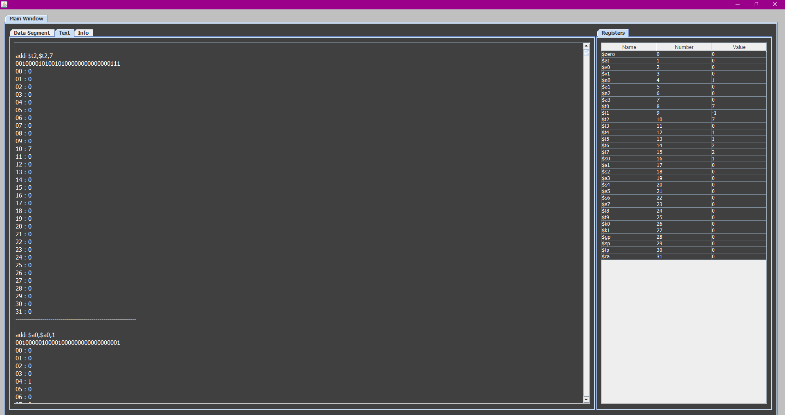
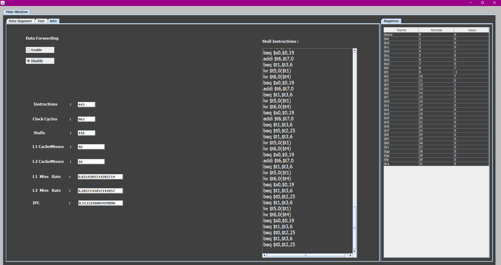

# MIPS32 Simulator

## How it works?
> The MIPS32 Simulator displays a graphical user interface to upload an assembly file present anywhere in your computer. It asks you to enter some values like sizes of level 1 and level 2 caches, block sizes etc. Based on the entered values, it executes the assembly instructions and displays a GUI. In the GUI, it shows the values stored in the registers in the Registers section and the values stored in the data segment in the Data Segment Section. In the Text section, it displays each instruction in the input file, its equivalent 32 bit binary form and the values of all the registers after executing that particular instruction. In the Info section, you can choose either to enable or disable data forwarding and see the total number of instructions executed, total number of clock cycles, total number of stalls, number of level 1 cache misses, number of level 2 cache misses, level 1 cache miss rate, level 2 cache miss rate and the instructions per clock cycle (IPC) for both data forwarding enabled and disabled.

> *The file bubblesort.asm is an assembly file which performs bubblesort on the given data and it is written based on our architecture.*
## Screenshots
<p>
    <br>
    <br>
    <br>
    <br>
</p>

## Instructions Implemented :
The simulator can run the following instructions:
```
* add
* sub
* mul
* slt
* and
* or
* addi
* subi
* bne
* beq
* lw
* sw
* j 
```
#### Note :
The branch instructions `bne`, `beq` and the `jump` instruction(j), jump to an instruction number rather than a label.

## Classes implemented in the Java program :
There are `9` Java classes in the program. The class GuiSimulator is the main class.

### GUI Class :
> The GUI class holds the code to create a graphical user interface. Using the GUI, users can upload an assembly file. After the execution of the uploaded file, the registers and the data segment are shown in the GUI.

### GuiSimulator Class :
> The GuiSimulator class creates an object of the GUI class and invokes the functions on this object to display the graphical user interface. 

### Register Class :
> The Register class deals with all the registers. It reads from the registers and writes to the registers. It also returns the number of the register depending on the name used, such as $s7.

### Memory Class :
> The Memory class plays the role of RAM in a computer. The data in the Memory can be loaded to the registers and the data in the registers can be stored in the Memory.

### FileReader Class :
> The FileReader class stores the input file in a txt file and accesses it directly from this file. There will be a file reader and a file writer in this class; the file reader will save the last read line that way, if we need to continue reading, we don't have to read again from the start, but we'll continue from where we last left

### Parser Class :
> The Parser class takes the input file and decodes the instructions line by line.

### Processor Class :
> The Processor class takes the decoded instructions and executes them line by line.

### Simulator Class :
> The Simulator class creates objects of Register, DataSegment, Memory, Pareser and Processor classes. It invokes the functions on these objects and executes the program.

### Cache Class:
> The Cache class is used to check if the required data is present in it before going to the Memory. If the required data is present in the Cache object, we can access the data from it directly without going to the Memory. If the data is not present in it, then we fetch the data from the Memory and store it in the Cache object. Our simulator supports two levels of caches and it implements the Least Recently Used(LRU) cache replacement policy.
> 
## Design Decisions
>   The simulator has a memory of size 1 kilo words or 1024 words. And the memory is word addressable. That is, we can access 4 bytes at a time from the memory. The valid instructions for the simulator are add, sub, mul, slt, and, or, addi, subi, bne, beq, lw, sw and j. Here the jump instruction is implemented such that it can only jump to an instruction number specified but not to a label. The MIPS pipleline is implemented with the five stages: IF, ID/RF, Ex, M and WB. All the stages are assumed to take 1 clock cycle except for the memory stage.
   
## About Cache :
* A two level Cache is implemented with the `LRU` cache replacement policy.
* The Cache is `Non Inclusive`; and `Write Back` policy is implemented.
* The configuration of the cache like the cache size, block size, associativity, hit time and also the memory access time can be set by the user before starting the simulator.     The time taken to execute the memory stage is dependent on the configuration set by the user.

## Stalls :
 * The simulator is implemented such that it detects all the data hazards and control hazards; and the user has an option to either enable or disable data forwarding.
 *  All the possible cases where stalls may arise have been identified for both data forwarding enabled and disabled cases and the simulator is implemented such that it detects   the hazards and updates the stall cycles accordingly.
 *   The stall cycles for the memory stage are also taken care of.
 *   According to the Cache configuration and memory access time set by the user, the stall cycles will be updated for the memory stage as well.
   
## Branch Predictor :
* Not taken.

